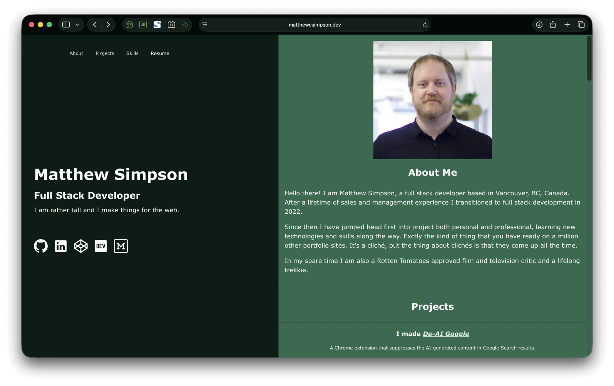

# MatthewCSimpson.dev

A modern, responsive developer portfolio built with Vite, React, TypeScript, Sass, and React Router. It showcases personal and professional projects, technical skills, and resume details.

[Visit the live site](https://matthewcsimpson.dev)

## Features

- Fast build and development workflow with Vite
- Component-based UI with React 19
- Type-safe code with TypeScript
- Modular SCSS architecture with shared partials
- Markdown support for rich project detail content
- Project-specific detail pages with React Router
- Download link support for project assets (for example zip files)
- Optional Google Analytics initialization in production

## Tech Stack

- Vite
- React
- TypeScript
- Sass/SCSS
- React Router
- react-markdown + remark-gfm
- ESLint

## License

This repository uses a dual-license model:

- **Code** is licensed under the [MIT License](./LICENSE).
- **Content and assets** (including text, images, resume files, and branding) are licensed under [All Rights Reserved](./LICENSE-CONTENT).

© Matthew Simpson.
